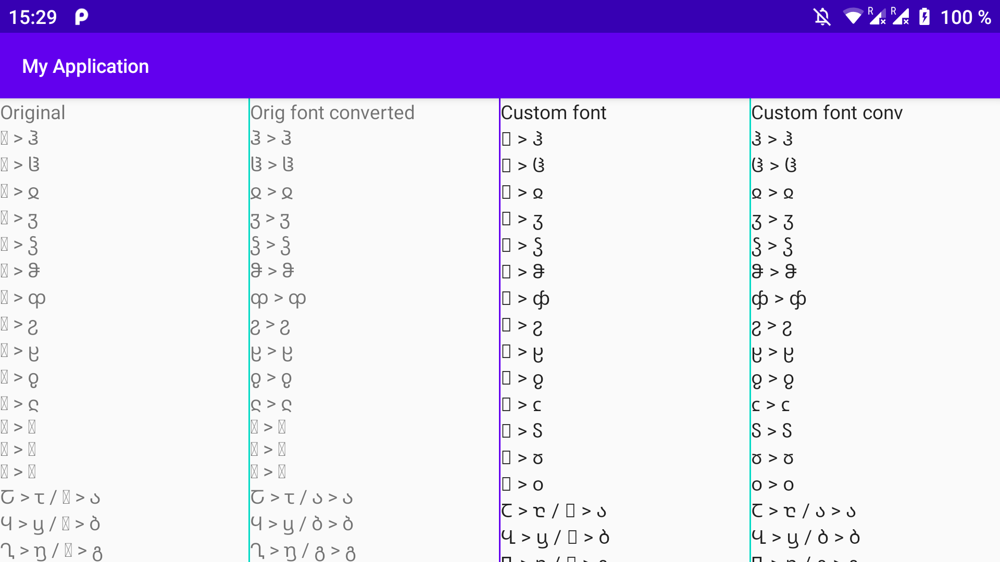

# android-georgian-uppercase

Georgian Extended Unicode Block were added in Android 10, so lower versions don't have support for it and show square glyphs.

This demo app demonstrate, how to replace Georgian Mtavruli to Georgian Mkhedruli

Demo app now support only Android API 24+, need add support for lower versions...

